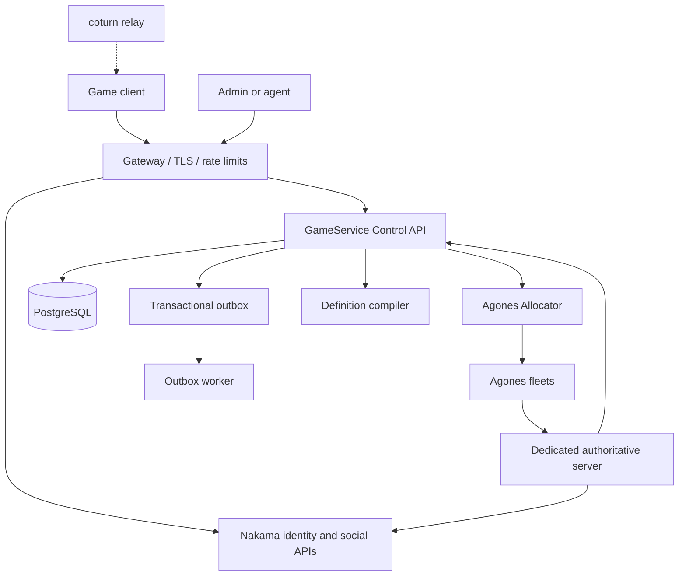

# GameService

GameService is a self-hosted declarative game backend designed to complement
GNS.NET. The implementation follows `codex(7).md`: Nakama owns identity and
social capabilities, GameService owns domain state, PostgreSQL is the durable
coordination substrate, and Agones owns dedicated-server lifecycle.

## Current status

The repository contains a durable command/outbox foundation, transactional
economy operations (including atomic wallet/inventory transfers with balanced
double-entry currency records), a deterministic definition compiler, persistent match
lifecycle state, and an Agones allocator boundary. The control API stores
command results in PostgreSQL and replays duplicate request IDs without
appending another outbox event. Nakama owns profile and social operations through
authenticated runtime RPCs; player profile commands are routed through that
boundary without holding a GameService transaction across the network call. The
Kind/Agones validation deployment, auditable player restrictions, and independent
economic reconciliation are implemented. Production Kubernetes rollout and full
production hardening remain outstanding.

Authenticated players can request account export or deletion with
`POST /v1/players/me/privacy/export` and
`POST /v1/players/me/privacy/delete`; both require an `Idempotency-Key`.
See [`docs/privacy-retention.md`](docs/privacy-retention.md) for ownership,
tombstones, and retention boundaries.

CI also runs dependency vulnerability, secret, filesystem misconfiguration,
and SBOM checks; production image signing and admission remain deployment-
environment responsibilities described in [`docs/supply-chain.md`](docs/supply-chain.md).
The exact pinned validation image IDs are recorded in
[`docs/compatibility-baseline.md`](docs/compatibility-baseline.md).

## Development

Requirements for local checks: Go 1.26.5+. Runtime Docker deployment is performed
on the configured VPS; the workstation is not the target runtime.

```text
go test ./...
go run ./cmd/definition-compiler --file definitions/examples/arena.yaml
make dev-core
make dev-full
make seed
```

The API listens on `:8080` by default. Health endpoints are available at
`/health/live` and `/health/ready`; commands are posted to `/v1/commands` and
stored results can be read at `/v1/commands/{requestId}`.

`make seed` runs the Dockerized seed job, publishes the example definition
through the immutable definition store, and activates it for `dev`. It is
intended for development or a disposable smoke environment; production
definitions must use the reviewed admin publish/activate workflow.

Agents and admin tooling should use `POST /v1/admin/definitions/dry-run` with
the `definition:validate` scope before requesting publication. The endpoint
compiles the submitted definition and returns its digest, optional revision
diff, active environments, running-match count, and queued-ticket count. It is
strictly non-mutating; publication and production activation remain separate
scoped operations.

Production (`prod` or `production`) activation and rollback additionally
require `definition:approve`: one actor creates the approval and a different
actor approves the same game, environment, revision, and digest. The returned
approval ID is supplied as `X-Approval-Id` to the activation or rollback
request. Development and staging activation retain the normal activation scope.

`make dev-full` creates a Kind cluster using Kubernetes `v1.36.1`, installs
the pinned Agones `1.60.0` chart, builds/loads the local simulator image, and
deploys the smoke Fleet and FleetAutoscaler. The Kubernetes version is pinned
to Agones' supported range. The Kind manifest uses development-only
credentials and is not a production deployment manifest. If `helm3` is
available it is selected automatically because the Agones chart currently
requires Helm 3 CRD patch semantics; otherwise the configured `helm` binary is
used.

Dedicated-server assignment is dynamic in the Kind smoke Fleet: the matchmaking
worker sends match/allocation/build/roster metadata through Agones allocation,
and the simulator consumes it through the Agones SDK. Join authorization still
requires a Control API-signed claim.

The configured VPS Kind cluster also has External Secrets Operator `2.10.0`
installed for validating the opt-in `ExternalSecret` chart resources. Its
provider and workload identity are deployment-specific; see
`docs/runbooks/kubernetes-addons.md` before enabling external secret sync.

The real Agones E2E harness is `tests/e2e/match_test.go`. It is deliberately
environment-gated so a normal unit run cannot pretend that Kubernetes exists.
After deploying the Kind smoke stack, run it with two test identities and a
port-forward to the allocated simulator control port:

```text
GAMESERVICE_E2E_API_URL=http://127.0.0.1:8080 \
GAMESERVICE_E2E_SESSION_SIGNING_KEY=... \
GAMESERVICE_E2E_PLAYER_A=e2e-a \
GAMESERVICE_E2E_PLAYER_B=e2e-b \
GAMESERVICE_E2E_SERVER_URL=http://127.0.0.1:17001 \
go test -tags=e2e ./tests/e2e -run TestSyntheticMatchLifecycle -count=1
```

For the Kind simulator, create the port-forward against the corresponding
pod, not the Agones `GameServer` custom resource:

```text
kubectl -n platform-gameservers-eu-west port-forward pod/<gameserver-name> 17001:7001
```

The test creates two real tickets, waits for their shared match and Ready
server, obtains player join claims, joins both players, submits a result, and
verifies the durable Completed state and matched ticket association. Set
`GAMESERVICE_E2E_SERVER_TOKEN` as well to verify duplicate result acknowledgement
through the server-result endpoint; do not print or commit that token.

Nakama also loads the JavaScript bridge in `nakama/runtime/index.js`. Its
`gameservice.health` RPC performs a bounded health check against the Control
API, while `gameservice.profile` reads and patches only the authenticated
Nakama account through supported runtime APIs. The Control API's
`profile.get` and `profile.patch_public_fields` commands call that runtime
boundary with the caller's verified session and persist an idempotent command
result. Domain mutations remain owned by GameService and Nakama-owned tables
are not accessed by the bridge.

The Compose TURN relay publishes a bounded 100-port UDP allocation range;
increase it only after measuring concurrent relay demand and host capacity.

Compose initializes a deployment-only `gameservice_admin` PostgreSQL role, then
bootstraps a non-superuser `gameservice` role for GameService and a dedicated
`nakama` role for Nakama migrations and runtime storage. The bootstrap job
revokes the control-plane schemas from the Nakama role. Set
`GAMESERVICE_ADMIN_PASSWORD`, `POSTGRES_PASSWORD`, and
`NAKAMA_DATABASE_PASSWORD` to distinct secrets in the deployment `.env`; do
not reuse them.

Pinned candidate images are recorded in `deploy/compose/compose.yaml` and must
be resolved to immutable digests by the compatibility smoke test before a
production baseline is declared.

The compose stack includes an OpenTelemetry Collector, PostgreSQL migrations and the continuously running
transactional outbox worker, plus coturn for GNS.NET relay fallback. The
optional reconciliation worker compares wallet projections with immutable ledger
entries and reports mismatches without editing financial history:

```text
docker compose --env-file .env -f deploy/compose/compose.yaml --profile reconciliation up -d --build reconciliation-worker
```

The Nakama leaderboard consumer is available through the `leaderboards` Compose
profile and consumes `match.result.accepted.v1` with a per-consumer checkpoint;
it expects authoritative result payloads in the form
`{"players":[{"playerId":"...","score":123,"subscore":0}]}`. The
published match-mode rating policy may also include an authoritative Nakama
tournament (`rating.tournament`). The worker creates the tournament through
the server-only runtime RPC and writes each accepted player result there; the
Nakama runtime HTTP key is required only by that worker and never reaches a
client. Tournament IDs and durations are immutable definition inputs, so
changing them requires a new published revision.
Agones-backed matchmaking worker is available through the `matchmaking` Compose
profile and requires mounted allocator mTLS material. Set `TURN_REALM`
and a long random `TURN_SECRET` only in the deployment environment; never commit
them. Expose UDP/TCP 3478, TLS 5349, and the configured relay range in the VPS
firewall. GNS.NET signaling should mint short-lived TURN credentials from this
secret and return them through its authenticated signaling endpoint.

### Load and chaos profiles

The load profile is a real HTTP harness, not a unit-test alias. It is gated by
deployment credentials and exercises authenticated snapshot, inventory, and
matchmaking ticket create/cancel paths while reporting p50, p95, and maximum
latency:

```text
GAMESERVICE_LOAD_API_URL=http://127.0.0.1:8080 \
GAMESERVICE_LOAD_SESSION_SIGNING_KEY=... \
GAMESERVICE_LOAD_PLAYER=load-player \
GAMESERVICE_LOAD_REQUESTS=100 \
GAMESERVICE_LOAD_WORKERS=10 \
go test -tags=load ./tests/load -run TestHTTPProfiles -count=1 -v
```

`GAMESERVICE_LOAD_PROFILES` can narrow the run to `auth`, `snapshot`,
`inventory`, or `matchmaking`. The matchmaking profile cancels every ticket
it creates. The chaos profile is explicitly opt-in and only permits restarting
application services; it will not target PostgreSQL or Nakama:

```text
GAMESERVICE_CHAOS_ENABLE=1 \
GAMESERVICE_CHAOS_SERVICE=outbox-worker \
GAMESERVICE_CHAOS_DIR=/opt/gameservice \
GAMESERVICE_CHAOS_COMPOSE_FILE=deploy/compose/compose.yaml \
GAMESERVICE_CHAOS_HEALTH_URL=http://127.0.0.1:8080/health/ready \
go test -tags=chaos ./tests/chaos -run TestRestartServiceRecovers -count=1 -v
```

These profiles produce an execution result but do not constitute a capacity
claim; record the exact configuration and host saturation with each run.

The Nakama tournament integration contract can be rerun with a disposable
tournament ID and a valid Nakama UUID owner:

```text
GAMESERVICE_INTEGRATION_NAKAMA_URL=http://127.0.0.1:7350 \
GAMESERVICE_INTEGRATION_NAKAMA_RUNTIME_HTTP_KEY=... \
GAMESERVICE_INTEGRATION_TOURNAMENT_ID=... \
GAMESERVICE_INTEGRATION_OWNER_ID=... \
go test -tags=integration ./tests/integration -run TestNakamaAuthoritativeTournamentWriteIsIdempotent -count=1 -v
```

The opt-in moderation integration test additionally accepts
`GAMESERVICE_INTEGRATION_NAKAMA_SESSION` and
`GAMESERVICE_INTEGRATION_MODERATION_TOKEN`; the Nakama runtime must be started
with that token in `GAMESERVICE_MODERATION_BLOCKLIST`.

The privacy integration test creates and deletes a disposable Nakama device
account. It additionally requires
`GAMESERVICE_INTEGRATION_NAKAMA_SERVER_KEY` and verifies export, delete, and a
retry of delete through the server-only runtime RPC.

## Topology

The target runtime boundary is the configured VPS. Docker Compose runs the
currently implemented core services there; the workstation is used for source
changes, tests, and deployment commands only.



The coturn relay is the GNS.NET fallback path for client connectivity.

### Trust and ownership

Game clients and generated proposals are untrusted: they may authenticate,
read permitted state, and request validated commands. The edge handles TLS,
routing, WAF, and coarse rate limits but does not perform domain writes.
Nakama owns identity, sessions, social features, parties, chat, and
Nakama-owned storage. GameService owns definitions, economy, inventory,
matchmaking coordination, match state, result application, audit, and the
outbox. Agones owns dedicated-server allocation and lifecycle; it does not own
players, rewards, tickets, or authoritative results. Dedicated servers report
facts and results, while GameService applies durable rewards exactly once.

### VPS Docker deployment

The VPS Compose stack currently contains PostgreSQL, Nakama, the GameService
Control API, migrations, the outbox worker, and coturn. Images are selected by immutable digest
where available. The VPS-only `.env` file contains secrets and is never
committed. Deploy with:

```text
cd /opt/gameservice
docker compose --env-file .env -f deploy/compose/compose.yaml run --rm migrations
docker compose --env-file .env -f deploy/compose/compose.yaml up -d --build
# On the VPS Kind/Agones host, attach the allocator worker to the Kind network:
docker compose --env-file .env -f deploy/compose/compose.yaml -f deploy/compose/compose.kind.yaml --profile matchmaking up -d --build control-api matchmaking-worker
# Optional result-to-Nakama leaderboard delivery:
docker compose --env-file .env -f deploy/compose/compose.yaml --profile leaderboards up -d --build leaderboard-worker
docker compose --env-file .env -f deploy/compose/compose.yaml ps
```

This is the Docker deployment target for the current VPS. It is not a
production HA topology: Agones/Kubernetes, multiple API replicas, external
managed PostgreSQL HA/PITR, ingress/WAF, NetworkPolicies, and the remaining
workers are still required before production readiness.

The matchmaking worker signs a short-lived server claim for each allocation.
The claim is delivered as Agones allocation metadata and is bound to the match,
allocation, and server build. Configure the matching private/public key pair as
`SERVER_CLAIM_PRIVATE_KEY` for the worker and `SERVER_CLAIM_PUBLIC_KEYS` for
the Control API. The Control API also requires `JOIN_CLAIM_PRIVATE_KEY` to
issue player join claims; never put either private key in the Fleet manifest.

### Authentication boundary

Mutation and command-result endpoints require a Nakama session JWT in the
`Authorization: Bearer <token>` header. The Control API verifies the HS256
signature, expiry, not-before time, optional issuer/audience, and session token
type. It derives the actor ID from the verified Nakama `uid` (or `sub`) claim
and rejects a command whose body claims a different actor. Configure
`NAKAMA_SESSION_SIGNING_KEY` from the deployment secret; the Compose example
falls back to `NAKAMA_SESSION_ENCRYPTION_KEY` for the current Nakama setup.
Server result and lifecycle claims accept `SERVER_CLAIM_PUBLIC_KEYS` as a
comma-separated base64-raw Ed25519 public-key ring, allowing old and new keys
to overlap during rotation; `SERVER_CLAIM_PUBLIC_KEY` remains a single-key
compatibility fallback.

### Planned Kubernetes topology

Production follows the contract's trust zones and namespaces: `platform-edge`,
`platform-app`, `platform-gameservers-<region>`, `agones-system`, and
`platform-observability`. The edge routes authenticated traffic to at least
two Control API replicas and Nakama's documented cluster topology. Separate
migration jobs run before rollout; allocator and worker replicas use leases and
idempotency; Agones maintains a ready-server buffer; observability collects
metrics, logs, traces, and audit events. PostgreSQL is managed or operated as
HA with encrypted off-site backups and a defined RPO/RTO.
