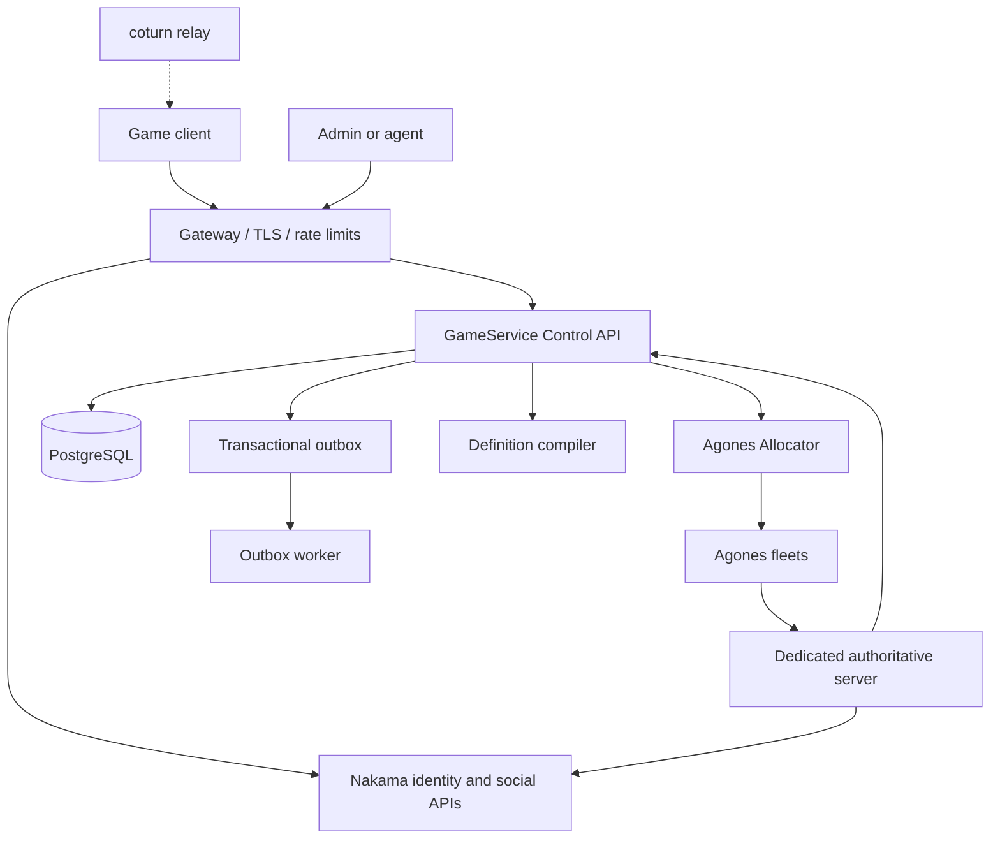

# GameService

GameService is a self-hosted declarative game backend designed to complement
GNS.NET. The implementation follows `codex(7).md`: Nakama owns identity and
social capabilities, GameService owns domain state, PostgreSQL is the durable
coordination substrate, and Agones owns dedicated-server lifecycle.

## Current status

The repository contains a durable command/outbox foundation, transactional
economy operations (including atomic wallet/inventory transfers with balanced
double-entry currency records), a deterministic definition compiler, persistent match
lifecycle state, and an Agones allocator boundary. The control API stores
command results in PostgreSQL and replays duplicate request IDs without
appending another outbox event. Nakama runtime extensions, Kubernetes
deployment, and full production hardening remain outstanding.

## Development

Requirements for local checks: Go 1.26.5+. Runtime Docker deployment is performed
on the configured VPS; the workstation is not the target runtime.

```text
go test ./...
go run ./cmd/definition-compiler --file definitions/examples/arena.yaml
make dev-core
make dev-full
```

The API listens on `:8080` by default. Health endpoints are available at
`/health/live` and `/health/ready`; commands are posted to `/v1/commands` and
stored results can be read at `/v1/commands/{requestId}`.

`make dev-full` creates a Kind cluster using Kubernetes `v1.36.1`, installs
the pinned Agones `1.60.0` chart, builds/loads the local simulator image, and
deploys the smoke Fleet and FleetAutoscaler. The Kubernetes version is pinned
to Agones' supported range. The Kind manifest uses development-only
credentials and is not a production deployment manifest. If `helm3` is
available it is selected automatically because the Agones chart currently
requires Helm 3 CRD patch semantics; otherwise the configured `helm` binary is
used.

Nakama also loads the JavaScript bridge in `nakama/runtime/index.js`. Its
`gameservice.health` RPC performs a bounded health check against the Control
API; domain mutations remain owned by GameService and Nakama-owned tables are
not accessed by the bridge.

The Compose TURN relay publishes a bounded 100-port UDP allocation range;
increase it only after measuring concurrent relay demand and host capacity.

Pinned candidate images are recorded in `deploy/compose/compose.yaml` and must
be resolved to immutable digests by the compatibility smoke test before a
production baseline is declared.

The compose stack includes an OpenTelemetry Collector, PostgreSQL migrations and the continuously running
transactional outbox worker, plus coturn for GNS.NET relay fallback. The
Nakama leaderboard consumer is available through the `leaderboards` Compose
profile and consumes `match.result.accepted.v1` with a per-consumer checkpoint;
it expects authoritative result payloads in the form
`{"players":[{"playerId":"...","score":123,"subscore":0}]}`. The
Agones-backed matchmaking worker is available through the `matchmaking` Compose
profile and requires mounted allocator mTLS material. Set `TURN_REALM`
and a long random `TURN_SECRET` only in the deployment environment; never commit
them. Expose UDP/TCP 3478, TLS 5349, and the configured relay range in the VPS
firewall. GNS.NET signaling should mint short-lived TURN credentials from this
secret and return them through its authenticated signaling endpoint.

## Topology

The target runtime boundary is the configured VPS. Docker Compose runs the
currently implemented core services there; the workstation is used for source
changes, tests, and deployment commands only.



The coturn relay is the GNS.NET fallback path for client connectivity.

### Trust and ownership

Game clients and generated proposals are untrusted: they may authenticate,
read permitted state, and request validated commands. The edge handles TLS,
routing, WAF, and coarse rate limits but does not perform domain writes.
Nakama owns identity, sessions, social features, parties, chat, and
Nakama-owned storage. GameService owns definitions, economy, inventory,
matchmaking coordination, match state, result application, audit, and the
outbox. Agones owns dedicated-server allocation and lifecycle; it does not own
players, rewards, tickets, or authoritative results. Dedicated servers report
facts and results, while GameService applies durable rewards exactly once.

### VPS Docker deployment

The VPS Compose stack currently contains PostgreSQL, Nakama, the GameService
Control API, migrations, the outbox worker, and coturn. Images are selected by immutable digest
where available. The VPS-only `.env` file contains secrets and is never
committed. Deploy with:

```text
cd /opt/gameservice
docker compose --env-file .env -f deploy/compose/compose.yaml run --rm migrations
docker compose --env-file .env -f deploy/compose/compose.yaml up -d --build
# Optional result-to-Nakama leaderboard delivery:
docker compose --env-file .env -f deploy/compose/compose.yaml --profile leaderboards up -d --build leaderboard-worker
docker compose --env-file .env -f deploy/compose/compose.yaml ps
```

This is the Docker deployment target for the current VPS. It is not a
production HA topology: Agones/Kubernetes, multiple API replicas, external
managed PostgreSQL HA/PITR, ingress/WAF, NetworkPolicies, and the remaining
workers are still required before production readiness.

### Authentication boundary

Mutation and command-result endpoints require a Nakama session JWT in the
`Authorization: Bearer <token>` header. The Control API verifies the HS256
signature, expiry, not-before time, optional issuer/audience, and session token
type. It derives the actor ID from the verified Nakama `uid` (or `sub`) claim
and rejects a command whose body claims a different actor. Configure
`NAKAMA_SESSION_SIGNING_KEY` from the deployment secret; the Compose example
falls back to `NAKAMA_SESSION_ENCRYPTION_KEY` for the current Nakama setup.
Server result and lifecycle claims accept `SERVER_CLAIM_PUBLIC_KEYS` as a
comma-separated base64-raw Ed25519 public-key ring, allowing old and new keys
to overlap during rotation; `SERVER_CLAIM_PUBLIC_KEY` remains a single-key
compatibility fallback.

### Planned Kubernetes topology

Production follows the contract's trust zones and namespaces: `platform-edge`,
`platform-app`, `platform-gameservers-<region>`, `agones-system`, and
`platform-observability`. The edge routes authenticated traffic to at least
two Control API replicas and Nakama's documented cluster topology. Separate
migration jobs run before rollout; allocator and worker replicas use leases and
idempotency; Agones maintains a ready-server buffer; observability collects
metrics, logs, traces, and audit events. PostgreSQL is managed or operated as
HA with encrypted off-site backups and a defined RPO/RTO.
