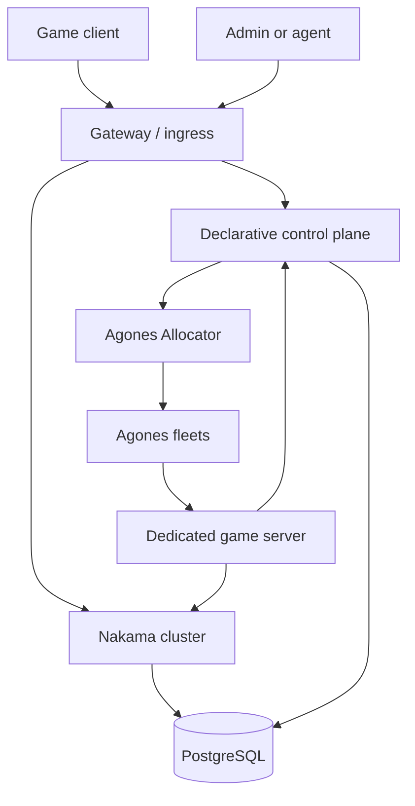
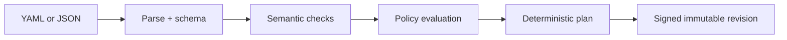
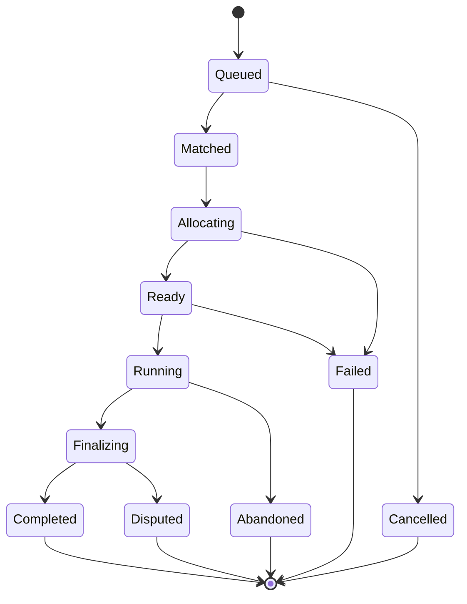

# Codex: Self-Hosted Declarative Game Backend

## 0. Document status

- **Purpose:** implementation contract for a self-hosted PlayFab-like platform.
- **Core stack:** Nakama + Agones + PostgreSQL + a custom declarative control plane.
- **Primary implementation language:** Go.
- **Client contract:** generated OpenAPI/JSON Schema plus Nakama client SDKs.
- **Baseline date:** 2026-09-14.
- **Version policy:** pin immutable, tested versions; never deploy floating `latest` tags.
- **Initial candidate pins:** Nakama `3.40.0`, Agones `1.60.0`, PostgreSQL `16.x`. Phase 0 must prove this combination and record exact image digests before calling it the compatibility baseline. Subsequent upgrades require an explicit compatibility PR with migration, integration, load, and rollback tests.

This file is both the system design and the build contract. An implementation agent must not silently invent missing requirements, bypass an invariant, or replace a named core component. If a choice materially affects protocol compatibility, security, persistence, or operating cost, record it as an ADR before implementation.

---

## 1. Product goal

Build an open, self-hosted game backend that gives game clients, trusted game servers, admin tools, and LLM agents one stable declarative interface for:

- player identity and sessions;
- profiles, social graph, groups, parties, chat, and notifications;
- inventory, currencies, entitlements, progression, achievements, and rewards;
- leaderboards and tournaments;
- queues, tickets, matchmaking, and dedicated-server allocation;
- versioned game definitions and LiveOps configuration;
- auditable administrative mutations;
- authoritative match-result ingestion;
- deployment on a laptop for development and Kubernetes for production.

The product is not a clone of PlayFab's internal service layout. It reproduces the useful capability surface while retaining ownership of infrastructure, data, schemas, and business logic.

### Success statement

A developer declares a game mode, catalog, rewards, matchmaking rules, and server fleet as versioned data. A client authenticates through Nakama, requests a match through the control plane, receives a short-lived connection claim for an Agones server, plays, and has the authoritative result committed exactly once. No client or LLM receives raw database, Nakama server-key, or Kubernetes authority.

---

## 2. Non-goals for the first release

- Building a custom identity provider to replace Nakama authentication.
- Running moment-to-moment simulation in the control plane.
- Reimplementing Kubernetes or Agones scheduling.
- Supporting arbitrary executable code inside declarative definitions.
- Letting clients directly mutate balances, inventory, entitlements, rankings, or match results.
- A drag-and-drop editor, billing platform, ad mediation, experimentation suite, data warehouse, or multi-cloud control plane.
- Cross-region active-active writes in MVP.
- Adding Redis, Kafka, or NATS before measured load or fan-out requirements justify them.

---

## 3. Architectural principles

1. **Declarative intent in, bounded operations out.** Definitions describe desired game behavior; the compiler maps them to a closed command registry.
2. **One owner for every write.** Each data class has exactly one authoritative service.
3. **Server-authoritative value.** Anything economically or competitively meaningful is mutated only by trusted server code.
4. **PostgreSQL is the durable coordination substrate.** Transactions, constraints, idempotency records, and an outbox are used before introducing another broker.
5. **Agones is infrastructure, not game state.** It allocates and manages game-server processes; it does not own parties, tickets, rewards, or results.
6. **Nakama is a product component, not a generic database facade.** Use its supported APIs and server runtime for Nakama-owned capabilities.
7. **Every external mutation is idempotent.** Retries must be safe.
8. **Definitions are immutable after publication.** Publish a new revision; do not edit history.
9. **No ambient authority.** Services and agents receive the smallest capability needed for the current operation.
10. **Observability is part of the contract.** Every request, allocation, match, and durable event carries correlation identifiers.

---

## 4. System topology



### Trust zones

| Zone | Components | Trust level | Permitted authority |
|---|---|---:|---|
| Untrusted | Game clients, public web UI, LLM-generated proposals | Low | Authenticate, read allowed state, request validated commands |
| Edge | Ingress, WAF, rate limiter | Medium | Route, terminate TLS, enforce coarse limits; no domain writes |
| Application | Nakama, control-plane API/compiler/workers | High | Domain mutations through explicit service identities |
| Game session | Dedicated server containers | High but short-lived | Validate join claims, run one match, submit signed result |
| Infrastructure | Agones controller/allocator, Kubernetes API | Critical | Server lifecycle only |
| Data | PostgreSQL, backups, object storage | Critical | Durable state, audit, recovery |

### Capability ownership

| Capability | Authoritative owner | Notes |
|---|---|---|
| Authentication and player session | Nakama | Control plane validates Nakama-issued session/JWT material; it does not issue player identities. |
| Profile/social/groups/chat/party | Nakama | Extend through Nakama runtime hooks/RPCs where required. |
| Nakama storage objects | Nakama | Never update Nakama tables directly. |
| Catalog, inventory, currency ledger, entitlements | Control plane | Stored in dedicated PostgreSQL schemas and exposed by commands. |
| Game definitions and revisions | Control plane | Schema-validated, compiled, immutable after publish. |
| Matchmaking tickets | Nakama first, adapter boundary | Use Nakama matchmaker for MVP. Preserve an adapter interface for future replacement. |
| Match record and lifecycle | Control plane | Stable match ID exists independently of pod or GameServer name. |
| GameServer allocation/lifecycle | Agones | Use the Allocator service in production. |
| Live match simulation | Dedicated server | Authoritative for session gameplay. |
| Leaderboards | Nakama | Result worker writes authoritative scores. |
| Audit and idempotency | Control plane/PostgreSQL | Append-only audit trail plus request/result deduplication. |

### Hard database boundary

Nakama and the control plane may share one PostgreSQL cluster initially, but they must use separate databases or, at minimum, separate schemas and database roles. The control plane must never read or write undocumented Nakama tables. Cross-owner data is accessed through supported APIs or a durable event/RPC contract.

---

## 5. Required repository layout

```text
/
├── codex.md
├── README.md
├── Makefile
├── go.work
├── .env.example
├── api/
│   ├── openapi.yaml
│   ├── asyncapi.yaml
│   └── schemas/
│       ├── command-envelope.schema.json
│       ├── game-definition.schema.json
│       ├── catalog.schema.json
│       ├── match-mode.schema.json
│       └── reward-table.schema.json
├── cmd/
│   ├── control-api/
│   ├── definition-compiler/
│   ├── outbox-worker/
│   └── simulator-server/
├── internal/
│   ├── auth/
│   ├── commands/
│   ├── compiler/
│   ├── economy/
│   ├── inventory/
│   ├── matchmaking/
│   ├── allocation/
│   ├── matches/
│   ├── progression/
│   ├── definitions/
│   ├── idempotency/
│   ├── outbox/
│   ├── audit/
│   └── telemetry/
├── nakama/
│   ├── runtime/
│   ├── modules/
│   └── local.yml
├── migrations/
│   ├── control/
│   └── testdata/
├── deploy/
│   ├── compose/
│   ├── helm/platform/
│   ├── agones/
│   ├── kind/
│   └── observability/
├── sdk/
│   ├── generated/
│   └── examples/
├── definitions/
│   ├── examples/
│   └── fixtures/
├── tests/
│   ├── contract/
│   ├── integration/
│   ├── e2e/
│   ├── load/
│   └── chaos/
└── docs/
    ├── adr/
    ├── runbooks/
    ├── threat-model.md
    └── data-ownership.md
```

Do not collapse the control plane into Nakama runtime code. Nakama hooks may call the control-plane internal API, but economy, inventory, compiler, and Agones integration remain separately testable packages and deployable processes.

---

## 6. Declarative API contract

### 6.1 Command envelope

All state-changing requests use one envelope:

```json
{
  "apiVersion": "game.platform/v1alpha1",
  "kind": "Command",
  "metadata": {
    "requestId": "01JXYZ...",
    "correlationId": "01JXYZ...",
    "gameId": "arena",
    "environment": "dev",
    "definitionRevision": 17
  },
  "actor": {
    "type": "player",
    "id": "nakama-user-uuid"
  },
  "spec": {
    "operation": "inventory.grant",
    "arguments": {
      "playerId": "nakama-user-uuid",
      "itemId": "iron_sword",
      "quantity": 1,
      "reason": "quest.complete",
      "sourceId": "quest:first_blood"
    }
  }
}
```

Rules:

- `requestId` is a caller-generated ULID and the idempotency key.
- `correlationId` is propagated through HTTP/gRPC, logs, database rows, outbox events, Nakama calls, and match-result processing.
- `gameId`, `environment`, and `definitionRevision` are mandatory; definitions never resolve implicitly to “whatever is current” during execution.
- `actor` is derived from verified credentials. Ignore or reject a conflicting actor supplied by the client.
- `operation` must exist in the compiled command registry. No reflective method names, SQL, script text, shell text, arbitrary URLs, or Kubernetes objects are accepted.
- Unknown fields are rejected for mutation commands.
- Request bodies have explicit depth, string length, collection size, quantity, and monetary bounds.

### 6.2 Result envelope

```json
{
  "requestId": "01JXYZ...",
  "correlationId": "01JXYZ...",
  "status": "succeeded",
  "operation": "inventory.grant",
  "result": {
    "itemId": "iron_sword",
    "quantity": 1,
    "newBalance": 2,
    "inventoryVersion": 42
  },
  "events": ["inventory.item_granted.v1"],
  "completedAt": "2026-09-14T00:00:00Z"
}
```

Errors use stable machine codes:

```json
{
  "requestId": "01JXYZ...",
  "status": "rejected",
  "error": {
    "code": "INSUFFICIENT_FUNDS",
    "message": "The wallet cannot fund this transaction.",
    "retryable": false,
    "details": {}
  }
}
```

Never expose SQL errors, stack traces, secrets, internal service addresses, raw Kubernetes objects, or policy internals to public clients.

### 6.3 Required MVP operations

| Namespace | Operations |
|---|---|
| `profile` | `get`, `patch_public_fields` |
| `inventory` | `list`, `grant`, `consume`, `transfer` (feature-gated) |
| `wallet` | `get`, `credit`, `debit`, `transfer` (feature-gated) |
| `entitlement` | `list`, `grant`, `revoke` |
| `progression` | `get`, `add_xp`, `complete_objective` |
| `reward` | `preview`, `claim` |
| `matchmaking` | `enqueue`, `status`, `cancel` |
| `match` | `get`, `issue_join_claim`, `submit_result`, `abandon` |
| `definition` | `validate`, `diff`, `publish`, `activate`, `rollback` |
| `admin` | `player_snapshot`, `execute_command`, `audit_search` |

Every operation declares:

- allowed actor types and scopes;
- input and output schema IDs;
- transaction isolation and lock strategy;
- idempotency behavior;
- rate-limit bucket;
- emitted events;
- audit redaction policy;
- maximum execution time;
- whether a dry run is supported.

### 6.4 Example game definition

```yaml
apiVersion: game.platform/v1alpha1
kind: GameDefinition
metadata:
  gameId: arena
  revision: 17
  labels:
    stage: development
spec:
  catalog:
    currencies:
      - id: coins
        precision: 0
        minBalance: 0
        maxBalance: 1000000000
    items:
      - id: iron_sword
        stackLimit: 1
        tags: [weapon, melee]
        tradeable: false
  progression:
    tracks:
      - id: account_level
        levels:
          - level: 1
            xpRequired: 0
          - level: 2
            xpRequired: 100
  rewards:
    - id: first_blood
      oncePerPlayer: true
      grants:
        - item: iron_sword
          quantity: 1
        - currency: coins
          amount: 100
  matchModes:
    - id: deathmatch
      minPlayers: 2
      maxPlayers: 8
      teamSize: 1
      ticketTimeout: 90s
      regions: [eu-west]
      fleetRef: deathmatch-v1
      serverBuild: sha256:REPLACE_WITH_IMAGE_DIGEST
      resultPolicy:
        schema: deathmatch-result-v1
        maxDuration: 20m
      rating:
        leaderboardId: deathmatch_rating
        strategy: authoritative
```

### 6.5 Compiler stages



The compiler must:

1. Parse YAML using safe mode and convert it to a canonical JSON representation.
2. Validate against a versioned JSON Schema.
3. Resolve references without network access.
4. Reject cycles, duplicate IDs, unknown operations, invalid reward graphs, negative quantities, numeric overflow, unavailable regions/fleets, and incompatible result schemas.
5. Enforce semantic invariants that JSON Schema cannot express.
6. Produce a deterministic plan and SHA-256 content digest.
7. Show a human-readable diff and impact summary.
8. Require authorization for publish/activate separately from validation.
9. Store source, canonical form, compiled form, actor, timestamp, digest, and validation report.
10. Make published revisions immutable.

An LLM can propose definitions and commands, but it never bypasses validation, policy, review gates, or service authorization. Treat model output exactly like untrusted user input.

---

## 7. HTTP API surface

The public API is `/v1`. Generate the OpenAPI document from code or verify code against a source-controlled OpenAPI document in CI; never maintain two drifting contracts.

```text
POST   /v1/commands
GET    /v1/commands/{requestId}

GET    /v1/players/me/snapshot
GET    /v1/players/me/inventory
GET    /v1/players/me/wallets

POST   /v1/matchmaking/tickets
GET    /v1/matchmaking/tickets/{ticketId}
DELETE /v1/matchmaking/tickets/{ticketId}
GET    /v1/matches/{matchId}
POST   /v1/matches/{matchId}/join-claims

POST   /v1/server/matches/{matchId}/ready
POST   /v1/server/matches/{matchId}/heartbeat
POST   /v1/server/matches/{matchId}/results

POST   /v1/admin/definitions/validate
POST   /v1/admin/definitions
POST   /v1/admin/definitions/{revision}/activate
POST   /v1/admin/definitions/{revision}/rollback
GET    /v1/admin/audit

GET    /health/live
GET    /health/ready
GET    /metrics
```

Use HTTP for client/admin commands and gRPC internally where streaming or generated strong typing materially helps. The Agones Allocator client should use its gRPC API with mTLS in production.

---

## 8. Identity, authentication, and authorization

### Player flow

1. Client authenticates through a supported Nakama client flow.
2. Client sends the Nakama session token to the gateway/control plane.
3. The control plane verifies signature, issuer/configuration, audience if used, expiry, token type, and session policy.
4. The verified Nakama user ID becomes the actor ID.
5. Fine-grained policy evaluates actor, operation, target resource, environment, and definition revision.

Do not accept player IDs in mutation payloads as proof of identity. A normal player may act only on their own resources unless a specifically reviewed operation permits otherwise.

### Service flow

- Workload identity or short-lived mTLS identities are preferred.
- Dedicated servers receive a match-scoped credential, not a global server key.
- A server may submit results only for its assigned match, fleet/build, and time window.
- Rotate signing keys and support overlapping verification keys during rollout.
- Never put Nakama server keys, database passwords, Kubernetes credentials, or allocator client private keys in game clients or images intended for distribution.

### Admin and agent flow

- Separate `read`, `propose`, `validate`, `publish`, `activate`, `grant`, and `break_glass` scopes.
- High-value grants and production definition activation require step-up authentication and optional four-eyes approval.
- Agents default to `propose` and `validate`; production mutation is a separately issued capability.
- All admin mutations require a reason, ticket/reference, actor identity, and audit record.

### Join claims

A join claim is a short-lived signed token containing:

```json
{
  "iss": "control-plane",
  "aud": "game-server",
  "sub": "nakama-user-uuid",
  "matchId": "01JMATCH...",
  "allocationId": "01JALLOC...",
  "serverBuild": "sha256:...",
  "team": "red",
  "slot": 2,
  "iat": 0,
  "nbf": 0,
  "exp": 0,
  "jti": "01JCLAIM..."
}
```

The game server validates signature, audience, time bounds, build, allocation, and slot. Claims are one-time or reconnect-bounded. Never embed the Agones allocator credential in a join token.

---

## 9. Matchmaking and allocation lifecycle

### State machine



### Happy path

1. Party leader or solo player creates a ticket through the control plane/Nakama adapter.
2. The service snapshots immutable ticket properties: player IDs, ratings, party, mode, compatible build, regions, latency buckets, and definition revision.
3. Nakama matches tickets. A trusted callback creates a stable `match_id` and roster.
4. The allocation worker changes `Matched -> Allocating` using optimistic concurrency.
5. It calls Agones Allocator with namespace and required/preferred selectors for fleet, build digest, region, mode, and capacity class.
6. The allocated address/ports/GameServer name are encrypted or access-restricted in the match record.
7. The server boots, uses the Agones SDK health/lifecycle integration, and calls the control-plane ready endpoint with its workload identity.
8. Control plane changes `Allocating -> Ready`, issues player join claims, and notifies players through Nakama.
9. Server accepts only rostered players with valid claims and moves the match to `Running`.
10. Server submits a canonical result with a monotonically increasing result sequence and payload digest.
11. In one database transaction, the result handler validates/deduplicates, records the result, applies rewards/progression/economy mutations, and appends outbox events.
12. A worker updates Nakama leaderboards/notifications idempotently and marks delivery checkpoints.
13. Server calls Agones shutdown after finalization or the configured drain timeout.

### Allocation selectors

Every Fleet and GameServer carries labels such as:

```yaml
metadata:
  labels:
    platform.game/id: arena
    platform.game/mode: deathmatch
    platform.game/build: build-2026-09-14-001
    platform.game/region: eu-west
    platform.game/protocol: "3"
```

Selection uses required labels for game, mode, protocol, and approved build. Region and cost class may be preferred selectors. Never allocate “any Ready server” without compatibility constraints.

### Failure rules

- Allocation timeout: mark the attempt failed, retry with bounded exponential backoff and jitter, then return players to a queue or fail visibly.
- Ready timeout: quarantine the allocated server, request shutdown, and allocate a replacement within a bounded attempt count.
- Duplicate callback: return the stored result for the same idempotency key.
- Partial notification failure: durable state remains committed; outbox delivery retries.
- Server crash before result: apply the mode's explicit abandonment/recovery policy; never fabricate a winner.
- Late result: accept only if match state, server identity, sequence, digest, and grace window permit it.
- Conflicting result for the same match/sequence: reject, preserve both digests in security telemetry, and move to `Disputed` if policy requires.

---

## 10. Agones contract

### Kubernetes resources

- One `Fleet` per compatible game/mode/build/region combination unless measured scale justifies coarser grouping.
- A `FleetAutoscaler` maintains a ready buffer. Start with buffer policy; introduce webhook policy only when queue-driven forecasts demonstrably improve cost or latency.
- `PodDisruptionBudget`, topology spread, resource requests/limits, probes, node selectors/tolerations, and graceful termination are mandatory in production.
- Container images are selected by digest. Tags may aid humans but are not the deployment identity.
- Game server containers run non-root, read-only where possible, with dropped Linux capabilities, a seccomp profile, and no Kubernetes API credentials.

### Allocator access

- Production allocation uses the external or internal Agones Allocator service with mTLS.
- The control-plane allocation worker is the sole allocation caller.
- Keep allocator certificates in the secret manager and rotate them.
- Kubernetes RBAC fallback is allowed only for local development or an ADR-approved deployment; scope it to `gameserverallocations` in the target namespaces.

### Dedicated-server SDK behavior

Each game server must:

1. Start its network listener.
2. Initialize the Agones SDK.
3. Report health continuously with a failure threshold lower than the match ready timeout.
4. Call `Ready` only after assets, configuration, and listener are ready.
5. Validate the assigned match bootstrap document and definition digest.
6. Reject unassigned players.
7. Call `Shutdown` after result acknowledgement and a bounded reconnect/drain window.

Game servers must not decide durable rewards. They report facts/results; the control plane applies the published reward policy.

---

## 11. PostgreSQL data model

Use UUIDv7 or ULID identifiers consistently. Use UTC `timestamptz`. Monetary values are integers in the currency's smallest declared unit; never use floating point. Quantities use checked integer arithmetic.

### Logical schemas

| Schema | Contents | Writer |
|---|---|---|
| `platform` | games, environments, definitions, commands, idempotency | Control API/compiler |
| `economy` | catalogs, wallets, ledger entries, inventory, entitlements | Economy domain service |
| `match` | tickets, matches, rosters, allocation attempts, results | Match services |
| `ops` | outbox, inbox/delivery checkpoints, audit, job leases | API/workers |
| Nakama-owned | Nakama internal tables | Nakama only |

### Minimum tables

```text
platform.games
platform.environments
platform.definition_revisions
platform.definition_activations
platform.command_requests

economy.catalog_items
economy.wallet_accounts
economy.ledger_transactions
economy.ledger_entries
economy.inventory_stacks
economy.entitlements
economy.reward_claims

match.tickets
match.ticket_members
match.matches
match.roster_members
match.allocation_attempts
match.join_claims
match.results

ops.outbox_events
ops.delivery_checkpoints
ops.audit_log
```

### Required constraints

- Unique `(game_id, environment, request_id)` on command requests.
- Unique published `(game_id, revision)` plus immutable-content enforcement.
- Unique `(player_id, reward_id, source_id)` for once-only rewards.
- Unique `(match_id, result_sequence)` and stored payload digest.
- Unique active ticket membership per player/mode where policy requires it.
- Wallet balances cannot violate configured minimum/maximum.
- Inventory quantities cannot be negative and cannot exceed stack constraints.
- Ledger entries for a transaction must balance according to the transaction type.
- Foreign keys are real, indexed, and use deliberate delete behavior.

### Transactions and concurrency

- Use database transactions for every multi-row domain mutation.
- Use unique constraints as the final idempotency guard.
- Lock wallet/inventory rows in deterministic order to avoid deadlocks.
- Use `SERIALIZABLE` only for flows that require it; otherwise use row locks and explicit version columns.
- Retry serialization/deadlock failures a bounded number of times with jitter.
- Never hold a database transaction open while calling Nakama, Agones, or another network service.
- Write an outbox record in the same transaction as domain state. Deliver external effects after commit.

### Economy ledger

Balances must be derivable from immutable ledger entries. A mutable balance may be maintained as an optimized projection, but each change references one ledger transaction, actor, reason, source, definition revision, request ID, and correlation ID. Corrections are compensating entries; never edit financial/economic history.

### Data retention

Define and test retention separately for:

- authentication/session data;
- chat and social content;
- player state;
- economy/audit ledger;
- match telemetry and full results;
- operational logs, traces, and metrics;
- deleted-account tombstones required for deduplication or legal obligations.

Account deletion must be an orchestrated, auditable workflow that respects referential and fraud-prevention requirements without leaving public personal data behind.

---

## 12. Nakama integration

Use Nakama for its supported product capabilities rather than recreating them in the control plane.

### Runtime module responsibilities

- Register only the hooks and RPCs needed to bridge matchmaking, notifications, initialization, and server-authoritative operations.
- On first account creation, initialize minimal profile state idempotently.
- Validate ticket properties before they enter matchmaking.
- Convert matchmaker output into one authenticated internal callback.
- Expose no general-purpose proxy to the control plane.
- Time-bound all outbound calls and propagate correlation IDs.

### Runtime language

Prefer the Go runtime when the module needs strong typing, shared domain packages, or high-throughput work. If TypeScript is selected for faster iteration, treat Nakama's TypeScript runtime constraints as a target environment rather than assuming full Node.js compatibility. Record the choice in an ADR and keep the HTTP contract language-neutral.

### Storage guidance

- Nakama storage is appropriate for Nakama-adjacent, permissioned JSON player objects.
- Core economy ledger, definition history, allocation records, and audit remain in control-plane schemas.
- Never make direct SQL changes to Nakama-owned storage tables.
- Use Nakama storage version checks for optimistic concurrency when modifying Nakama objects.

### Leaderboards

- Define leaderboard IDs deterministically from the published game definition.
- Only trusted result-processing code writes competitive scores.
- Store the originating match/result digest with the delivery checkpoint.
- Rebuild/reconcile projections from accepted match results where possible.

---

## 13. Event and outbox contract

Events use a CloudEvents-like envelope and versioned names:

```json
{
  "id": "01JEVENT...",
  "type": "match.completed.v1",
  "source": "control-plane/matches",
  "subject": "match/01JMATCH...",
  "time": "2026-09-14T00:00:00Z",
  "correlationId": "01JXYZ...",
  "gameId": "arena",
  "environment": "prod",
  "definitionRevision": 17,
  "data": {}
}
```

Requirements:

- Producers append to `ops.outbox_events` within the domain transaction.
- Workers claim batches with `FOR UPDATE SKIP LOCKED`, use leases, and record attempts.
- Delivery is at least once; consumers are idempotent.
- Ordering is guaranteed only for the same aggregate key where explicitly required.
- Poison events enter a visible dead-letter state after bounded retries; they are not discarded.
- Event payloads contain references/minimal facts, not secrets or unnecessary personal data.
- Schema compatibility tests prevent breaking an existing event version.

Introduce NATS JetStream or another broker only behind the event publisher/consumer interfaces. PostgreSQL remains the system of record; broker acknowledgement is not the domain commit.

---

## 14. Security requirements

### Mandatory controls

- TLS externally; mTLS or workload identity for sensitive service-to-service calls.
- Secrets from a secret manager or sealed/encrypted Kubernetes mechanism, never committed YAML.
- Passwords/tokens/certificates redacted from logs.
- Parameterized SQL only.
- Strict content types and schema validation.
- Per-actor, per-IP, per-operation, and expensive-path rate limits.
- Request body and decompression limits.
- Egress allowlists for server and control-plane workloads.
- Kubernetes NetworkPolicies separating ingress, application, gameserver, database, and observability namespaces.
- Image signing/provenance, digest pins, SBOMs, vulnerability scans, and admission policy in production.
- Database roles per process with no superuser runtime accounts.
- Encrypted backups plus routinely tested restore procedures.
- Append-only/tamper-evident audit export for privileged operations.

### Declarative/agent threat model

Treat definitions as data, never executable authority:

- no embedded JavaScript/Lua/Go, templates that evaluate code, shell commands, SQL fragments, dynamic imports, or arbitrary webhooks;
- references resolve only within the same game/environment and approved registry;
- all side effects map to a static command handler;
- preview produces a plan without execution;
- production activation uses a distinct endpoint and permission;
- enforce maximum graph size and compilation budget;
- canonicalize before hashing/signing;
- store the exact source and compiler version;
- a policy engine may deny valid schema based on environment risk limits.

### Abuse and cheating

- Never trust client-reported currency, rewards, kills, rank, elapsed time, or ownership.
- Bind match results to server identity, assignment, roster, build digest, and definition revision.
- Record suspicious duplicate/conflicting submissions.
- Rate-limit ticket churn and join-claim issuance.
- Make bans/restrictions available to matchmaking and server admission checks.
- Keep enforcement decisions explainable to operators without leaking detection details to players.

---

## 15. Local development

### Two local profiles

`make dev-core` starts Docker Compose:

- PostgreSQL;
- Nakama with migrations and runtime module;
- control API;
- compiler;
- outbox worker;
- OpenTelemetry Collector;
- optional Prometheus/Grafana profile.

`make dev-full` additionally starts a local Kubernetes cluster (Kind or Minikube), installs the pinned Agones Helm chart, deploys a simulator Fleet/FleetAutoscaler, and configures the control plane to use the local Allocator.

Docker Compose is not the production topology and must not pretend to run Agones outside Kubernetes. For quick unit/API work, provide a fake allocator implementing the same interface with deterministic behavior.

### Required developer commands

```text
make bootstrap       # verify tool versions and install dev-only generators
make generate        # schemas, OpenAPI clients, mocks; fail on dirty diff in CI
make lint
make test
make test-integration
make test-e2e
make dev-core
make dev-full
make down
make migrate-up
make migrate-down-one
make seed
make definition-validate FILE=...
make load-smoke
```

`.env.example` contains names and safe local defaults only. Real credentials must not be committed.

---

## 16. Production deployment

### Namespaces

```text
platform-edge
platform-app
platform-gameservers-<region>
agones-system
platform-observability
```

Run PostgreSQL as a managed or properly operated HA service. Do not place a single unreplicated PostgreSQL pod in a production cluster and call it production-ready.

### Availability

- At least two control API replicas across failure domains.
- Nakama topology follows its documented clustering/deployment requirements.
- At least two allocator/control-plane worker replicas where leases/idempotency make concurrency safe.
- Ready game-server buffer sized from allocation SLO and boot time.
- Graceful shutdown and load-balancer draining for APIs.
- Migration jobs run separately before application rollout; application versions must tolerate the migration rollout order.

### Configuration promotion

Definitions follow:

```text
draft -> validated -> approved -> published -> activated -> superseded
```

Promotion between dev/staging/prod preserves the content digest. Environment overlays may alter an explicitly allowed set such as fleet sizing and hostnames; overlays cannot silently change catalog value, rewards, or competitive rules.

### Backups and disaster recovery

- Define RPO/RTO before production launch.
- Use PITR-capable PostgreSQL backups and off-site encrypted retention.
- Back up definition source/compiled artifacts and key metadata.
- Test restores into an isolated environment on a schedule.
- Document regional evacuation, credential rotation, lost allocator, failed migration, and corrupted projection runbooks.

---

## 17. Observability and SLOs

Use OpenTelemetry for traces/metrics/log correlation and Prometheus-compatible metrics. Avoid player IDs, match IDs, or request IDs as unbounded metric labels.

### Required telemetry

| Area | Metrics/events |
|---|---|
| API | request rate, latency histogram, status/error code, rejected schema/policy, rate limits |
| Commands | duration, idempotency hits, conflict/retry count, operation outcome |
| Matchmaker | queue depth, wait time, ticket churn, match quality buckets |
| Allocation | attempts, latency, failures by stable reason, ready timeout, replacements |
| Agones | Ready/Allocated/Unhealthy counts, fleet capacity, autoscaler desired/current |
| Matches | ready latency, duration, abandon/crash/dispute/result-finalization rates |
| Economy | transaction outcome, rejected invariant, reconciliation drift; no high-cardinality player labels |
| Outbox | backlog age/depth, delivery latency, retries, dead letters |
| PostgreSQL | connections, transaction latency, locks/deadlocks, replication lag, storage, backup status |

### Initial SLO targets

Treat these as launch hypotheses and revise with evidence:

- Authenticated control-plane reads: 99.9% availability monthly.
- Command acceptance p95: under 250 ms excluding explicitly asynchronous work.
- Allocation request p95: under 2 s when Ready capacity exists.
- Match-to-server-ready p95: under 10 s with warm capacity.
- Accepted result durable commit: 99.9% within 2 s.
- Outbox delivery p99: under 30 s during normal operation.

Alerts must be tied to user impact or exhaustion risk. Every paging alert links to a runbook.

---

## 18. Testing strategy

### Unit tests

- Schema and semantic validation, including property/fuzz tests.
- Command authorization matrix.
- Currency/inventory checked arithmetic and invariant tests.
- Reward idempotency.
- Match state transitions.
- Allocation selector construction.
- Join/result token validation and key rotation.
- Canonicalization/digest determinism.

### Contract tests

- OpenAPI request/response conformance.
- Generated SDK compatibility.
- Nakama runtime callback contract.
- Agones allocator adapter against pinned protobuf/API.
- Event schema backward compatibility.
- Dedicated-server bootstrap/result schemas.

### Integration tests

Use real PostgreSQL and Nakama containers. Verify:

- migrations from the last supported release;
- concurrent duplicate commands apply once;
- deadlock/serialization retries remain safe;
- outbox survives worker crashes between send and checkpoint;
- Nakama storage/version conflicts;
- leaderboard delivery and reconciliation;
- account initialization and deletion orchestration.

### End-to-end tests

Use a local Kubernetes cluster with real Agones and the simulator server:

1. Authenticate two fake players.
2. Create tickets and produce a match.
3. Allocate a compatible GameServer.
4. Wait for Ready and issue claims.
5. Join both players.
6. Submit one authoritative result twice.
7. Assert one reward/ledger mutation and one logical leaderboard update.
8. Confirm server shutdown and replacement buffer recovery.

### Chaos tests

- Kill the control API after DB commit but before response.
- Kill outbox worker after external delivery but before checkpoint.
- Kill GameServer before Ready and during Running.
- Make allocator unavailable.
- Introduce Nakama timeouts.
- Exhaust Ready capacity.
- Expire/rotate signing certificates.
- Restore PostgreSQL backup and reconcile projections.

### Load tests

Separate profiles for authentication, snapshot reads, inventory commands, matchmaking bursts, allocations, result bursts, and outbox recovery. Report throughput, latency percentiles, error taxonomy, database saturation, fleet behavior, and cost per concurrent match. Never publish a capacity claim without a reproducible configuration and test report.

---

## 19. CI/CD gates

Every pull request must run:

1. formatting and linting;
2. unit, race, and fuzz smoke tests;
3. schema/OpenAPI generation with clean-diff check;
4. migration lint and up/down/up verification;
5. dependency, secret, license, and vulnerability scans;
6. container build with SBOM and provenance;
7. Compose integration tests;
8. policy tests for Kubernetes/Helm manifests.

Main/release pipelines additionally run:

- Kind/Minikube Agones E2E;
- load smoke test;
- signed digest-pinned images;
- staging deployment and synthetic match;
- manual or policy-controlled production promotion;
- post-deploy synthetic match and rollback criteria.

Do not auto-run irreversible database migrations during arbitrary application pod startup.

---

## 20. Delivery phases

### Phase 0 — Architecture and skeleton

Deliver:

- repository structure;
- ADRs for Go runtime, data ownership, ID format, API source of truth, and local cluster;
- threat model;
- pinned version manifest;
- CI skeleton;
- Compose PostgreSQL + Nakama health check;
- Kind/Minikube Agones installation smoke test.

Exit criteria: a clean checkout can bootstrap both local profiles using documented commands.

### Phase 1 — Vertical match slice

Deliver:

- Nakama authentication;
- command envelope and idempotency store;
- one `deathmatch` definition;
- matchmaking adapter;
- Agones allocation worker;
- simulator dedicated server;
- join claims;
- result commit and one Nakama leaderboard;
- trace from ticket to completed result.

Exit criteria: the two-player E2E test passes repeatedly, including duplicate result submission and server replacement.

### Phase 2 — Economy and content

Deliver:

- catalog revisions;
- double-entry currency ledger;
- inventory/entitlements;
- atomic reward claims;
- progression/objectives;
- definition validation/diff/publish/activate/rollback;
- admin audit search;
- reconciliation jobs.

Exit criteria: concurrency/property tests cannot violate economic invariants and a published definition can be safely rolled forward/back.

### Phase 3 — Social/product completeness

Deliver through Nakama and narrow extensions:

- profiles;
- friends/groups;
- parties;
- chat/moderation hooks;
- notifications;
- tournaments and expanded leaderboards;
- bans/restrictions in queue/admission paths.

Exit criteria: documented capability matrix and client SDK examples cover the supported PlayFab-like surface.

### Phase 4 — Production hardening

Deliver:

- HA topology;
- autoscaling tuning;
- network/admission policies;
- key/certificate rotation;
- backups and verified restore;
- SLO dashboards and alerts;
- chaos/load reports;
- incident and disaster runbooks;
- privacy/delete/export workflows.

Exit criteria: launch-readiness review passes with evidence, owners, and rollback rehearsals.

### Phase 5 — Agent-native authoring

Deliver:

- schema-aware definition authoring tools;
- dry-run/impact plans;
- constrained agent scopes;
- approval workflow;
- evaluation corpus of valid, invalid, malicious, and ambiguous definitions;
- full provenance from prompt/proposal to activated digest.

Exit criteria: an agent can propose a playable mode but cannot activate production, access secrets, invent operations, or escape the schema/policy boundary.

---

## 21. Definition of done

The first production-capable release is done only when all of the following are true:

- A new developer can boot core services and full local Agones using the README.
- APIs and events are versioned, generated/validated, and covered by contract tests.
- Player clients have no trusted mutation path for economy, rank, or results.
- Every mutation is idempotent and audit-correlated.
- Published definitions are immutable, digest-addressed, reviewable, and reversible by activation change.
- Nakama tables are not accessed directly by control-plane code.
- The Agones Allocator is isolated behind one adapter and mTLS in production.
- A server crash, API retry, worker crash, or duplicate result cannot duplicate rewards.
- Database backup restore and post-restore reconciliation have been demonstrated.
- SLO dashboards, actionable alerts, and linked runbooks exist.
- Images and dependencies are pinned, scanned, signed, and reproducible.
- The complete E2E synthetic match runs after deployment.
- Known limitations and deferred features are documented honestly.

---

## 22. Instructions to implementation agents

1. Read this file, current ADRs, data-ownership map, and relevant package tests before changing architecture.
2. Work in the smallest complete vertical slice. Do not generate empty service shells for every future phase.
3. Prefer explicit typed code and boring transactions over reflection, generic “action” engines, or hidden magic.
4. Do not add infrastructure dependencies without measured need and an ADR.
5. Never fake successful integration, benchmark, security, migration, or E2E results. State what actually ran and preserve logs/artifacts in CI.
6. Never use mock-only green tests as evidence that Nakama or Agones integration works.
7. Keep generated files reproducible and clearly marked. CI must detect drift.
8. Add migrations forward; do not rewrite an already released migration.
9. For externally visible changes, update OpenAPI/schema, implementation, generated SDK, contract tests, examples, and migration/runbook as applicable in the same change.
10. Reject ambiguous authority. If it is unclear whether the client, Nakama, control plane, or game server owns a mutation, stop and resolve the ownership contract.
11. Preserve correlation IDs and stable error codes.
12. Make retries bounded and idempotent. Never solve a transient error with unbounded retry loops.
13. Use UTC, monotonic elapsed-time measurement where appropriate, and injected clocks/random sources in tests.
14. Do not log tokens, secrets, full payment receipts, private chat, or unrestricted definition payloads.
15. End each implementation task with commands run, actual outcomes, remaining risks, and the next smallest vertical step.

---

## 23. Initial ADR decisions

### ADR-001: Go control plane

**Decision:** build the API, compiler, allocator adapter, and workers in Go.

**Why:** one statically typed deployment language fits Kubernetes/Agones clients, concurrency, compact services, and potential Nakama Go runtime sharing. Domain packages must remain independent of transports and generated Kubernetes types.

### ADR-002: PostgreSQL outbox before a broker

**Decision:** use a transactional PostgreSQL outbox for MVP.

**Why:** it preserves atomicity with domain mutations and avoids introducing a second durability/operations system prematurely. The event interfaces permit a later NATS/Kafka adapter.

### ADR-003: Dedicated servers external to Nakama matches

**Decision:** Nakama coordinates identity/matchmaking/social features; Agones-hosted processes run authoritative realtime simulation.

**Why:** this keeps CPU/network-heavy game loops independently scalable and preserves normal dedicated-server engine choices.

### ADR-004: Definitions contain no executable scripts

**Decision:** definitions select from a versioned command/condition registry.

**Why:** declarative input from humans or LLMs remains analyzable, deterministic, diffable, and subject to policy.

### ADR-005: One PostgreSQL cluster allowed, direct Nakama SQL forbidden

**Decision:** share infrastructure initially if useful, but isolate roles/schemas and communicate through supported contracts.

**Why:** this reduces early operating cost without coupling the product to Nakama's private schema.

---

## 24. Open decisions that require evidence

Do not block Phase 0 on all of these, but resolve each before its dependent production feature:

- Nakama Go versus TypeScript runtime after a minimal callback prototype.
- Kind versus Minikube default based on Windows/WSL and CI ergonomics.
- PostgreSQL cluster/backup operator or managed service for the target host.
- Ingress/gateway implementation.
- Secret manager and workload-identity implementation.
- Exact rating algorithm and match-quality policy.
- Server transport (UDP/QUIC/WebSocket), NAT/relay requirements, and DDoS posture.
- Regional placement and latency measurement strategy.
- Retention/privacy requirements by launch jurisdiction and audience.
- Conditions that trigger adoption of NATS JetStream or another broker.

Each decision record includes context, alternatives, measured evidence, security/operational cost, decision, consequences, and rollback path.

---

## 25. Authoritative references

- [Nakama documentation](https://heroiclabs.com/docs/nakama/)
- [Nakama Docker Compose installation](https://heroiclabs.com/docs/nakama/getting-started/install/docker/)
- [Nakama matchmaker](https://heroiclabs.com/docs/nakama/concepts/multiplayer/matchmaker/)
- [Nakama authoritative multiplayer](https://heroiclabs.com/docs/nakama/concepts/multiplayer/authoritative/)
- [Nakama storage engine](https://heroiclabs.com/docs/nakama/concepts/storage/)
- [Nakama server framework](https://heroiclabs.com/docs/nakama/server-framework/)
- [Nakama releases](https://github.com/heroiclabs/nakama/releases)
- [Agones documentation](https://agones.dev/site/docs/)
- [Agones GameServer specification](https://agones.dev/site/docs/reference/gameserver/)
- [Agones Fleet specification](https://agones.dev/site/docs/reference/fleet/)
- [Agones GameServerAllocation specification](https://agones.dev/site/docs/reference/gameserverallocation/)
- [Agones FleetAutoscaler specification](https://agones.dev/site/docs/reference/fleetautoscaler/)
- [Agones Allocator service](https://agones.dev/site/docs/advanced/allocator-service/)
- [Agones game-server SDKs](https://agones.dev/site/docs/guides/client-sdks/)
- [Agones releases](https://github.com/agones-dev/agones/releases)
- [PostgreSQL documentation](https://www.postgresql.org/docs/)

When implementation behavior conflicts with this document, first determine whether the code, pinned upstream version, or this design is wrong. Update the contract and ADR deliberately; do not allow silent architectural drift.
